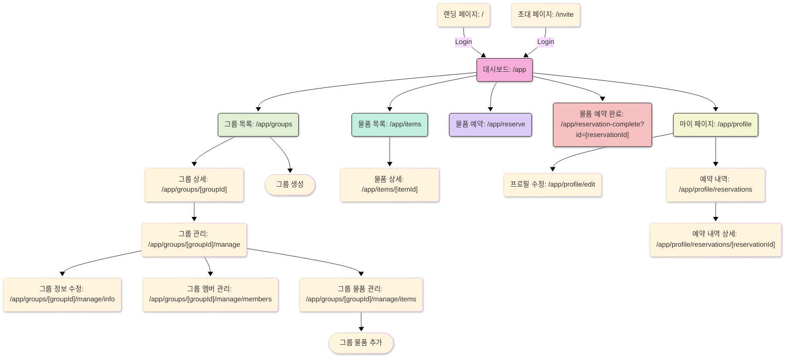

# WeShare 프로젝트

## 링크

[Component 보기(Storybook)](https://www.chromatic.com/library?appId=679f6f9efeda6bdd03477eb9)

## 프로젝트 소개

이 프로젝트는 그룹 내의 공용 물건을 관리하기 위한 웹 어플리케이션입니다.

## 프로젝트 동기

오프라인에서 같은 그룹 내에서 공용 물건을 관리할 때, 누가 물건을 사용하고 있는지, 어디에 있는지 등을 파악하기 어려웠습니다. 이를 해결하기 위해 그룹 내에서 공용 물건을 관리할 수 있는 웹 어플리케이션을 만들어보고자 합니다.

## 프로젝트 인원

- 기획: 2명
- 디자인: 1명
- 웹 프론트엔드: 1명
- 백엔드: 2명

## 프로젝트 구조

This Turborepo includes the following packages/apps:

### 리포지토리 구조

- `apps/docs`: a [Vite](https://nextjs.org/) app with Storybook
- `apps/web`: [Next.js](https://nextjs.org/) app with [Tailwind CSS](https://tailwindcss.com/)
- `packages/ui`: a stub React component library with [Tailwind CSS](https://tailwindcss.com/) shared by both `web` and `docs` applications
- `packages/icons`: a react icon library by svgr
- `apps/eslint-config`: `eslint` configurations (includes `eslint-config-next` and `eslint-config-prettier`)
- `apps/typescript-config`: `tsconfig.json`s used throughout the monorepo
- `apps/tailwind-config`: `theme.css` used throughout the monorepo

### 페이지 구조



## 문제

<details>
<summary>tailwindcss 적용 시 클래스 중복 문제</summary>

`ui:text-detail-3 ui:text-positive`를 적용하면 뒤에 오는 클래스만 적용되는 문제
`ui:text-positive` -> `ui:text-semantic-positive`으로 변경해보았지만 동일한 문제 발생
`ui:text-detail-3` -> `ui:text-detail3`로 변경해보았지만 동일한 문제 발생
`tailwind-merge config > classGroups`를 적용하여 문제 해결

```javascript
const twMergeConfig = {
  extend: {
    classGroups: {
      "font-size": [
        {
          text: [
            "heading-1",
            "heading-2",
            "heading-3",
            "heading-4",
            "heading-5",
            "body-1",
            "body-2",
            "body-3",
            "body-4",
            "body-5",
            "body-6",
            "detail-1",
            "detail-2",
            "detail-3",
          ],
        },
      ],
    },
  },
};
```

</details>

<details>
<summary>타입스클비트 형식 주석 문제</summary>

```plaintext
'BottomSheetContent'의 유추된 형식 이름을 지정하려면 '.pnpm/@radix-ui+react-dialog@1.1._79c1088916460d1027207019201b4fa5/node_modules/@radix-ui/react-dialog'에 대한 참조가 있어야 합니다. 이식하지 못할 수 있습니다. 형식 주석이 필요합니다.ts(2742)
```

```typescript
//tsconfig.json
{
  //...
  "compilerOptions": {
    "declaration": false,
    "declarationMap": false
  },
}
```

</details>

## 서버 세팅

<details>
<summary>1. Node.js 설치</summary>

<https://nodejs.org/ko/download>

```bash
# nvm 설치
curl -o- https://raw.githubusercontent.com/nvm-sh/nvm/v0.40.1/install.sh | bash

# 터미널 재시작

## Node.js 설치
nvm install 22


# Node.js 버전 확인:
node -v
nvm current
npm -v
```

</details>

<details>
<summary>2. Nginx 설치</summary>

1. Nginx 설치

```bash
sudo apt update
sudo apt install nginx
```

2. Nginx 방화벽 설정

```bash
sudo systemctl stop nginx
sudo ufw allow 'Nginx Full'
sudo ufw allow 'OpenSSH'
sudo ufw enable
```

3. Nginx 설정

```bash
sudo cat /etc/nginx/sites-available/default
```

```plaintext
server {
  listen 80;
  server_name _;
  location / {
    proxy_pass http://localhost:3000;
    proxy_http_version 1.1;
    proxy_set_header Upgrade \$http_upgrade;
    proxy_set_header Connection 'upgrade';
    proxy_set_header Host \$host;
    proxy_cache_bypass \$http_upgrade;
  }
}
```

4. Nginx 파일 링크 및 서비스 재시작

```bash
sudo ln -s /etc/nginx/sites-available/default /etc/nginx/sites-enabled/default
sudo systemctl enable nginx
sudo systemctl restart nginx
```

</details>

<details>
<summary>3. Docker 설치</summary>

<https://docs.docker.com/engine/install/ubuntu/>

```bash
# 1. 충돌 가능성이 있는 기존의 패키지들을 삭제
for pkg in docker.io docker-doc docker-compose docker-compose-v2 podman-docker containerd runc; do sudo apt-get remove $pkg; done

# 2. apt 리포지토리 셋업
## 2.1 Add Docker's official GPG key:
sudo apt update
sudo apt-get install ca-certificates curl
sudo install -m 0755 -d /etc/apt/keyrings
sudo curl -fsSL https://download.docker.com/linux/ubuntu/gpg -o /etc/apt/keyrings/docker.asc
sudo chmod a+r /etc/apt/keyrings/docker.asc

## 2.2 Add the repository to Apt sources:
echo \
  "deb [arch=$(dpkg --print-architecture) signed-by=/etc/apt/keyrings/docker.asc] https://download.docker.com/linux/ubuntu \
  $(. /etc/os-release && echo "${UBUNTU_CODENAME:-$VERSION_CODENAME}") stable" | \
  sudo tee /etc/apt/sources.list.d/docker.list > /dev/null
sudo apt-get update

# 3. Docker 설치
sudo apt-get install docker-ce docker-ce-cli containerd.io docker-buildx-plugin docker-compose-plugin
```

</details>

<details>
<summary>4. Docker 실행</summary>

```
sudo docker pull ${{ vars.DOCKERHUB_USERNAME }}/${{ vars.IMAGE_NAME }}:latest
sudo docker stop ${{ vars.IMAGE_NAME }} || true
sudo docker rm ${{ vars.IMAGE_NAME }} || true
sudo docker run -d -p 3000:3000 --name ${{ vars.IMAGE_NAME }} ${{ vars.DOCKERHUB_USERNAME }}/${{ vars.IMAGE_NAME }}:latest
```

</details>
