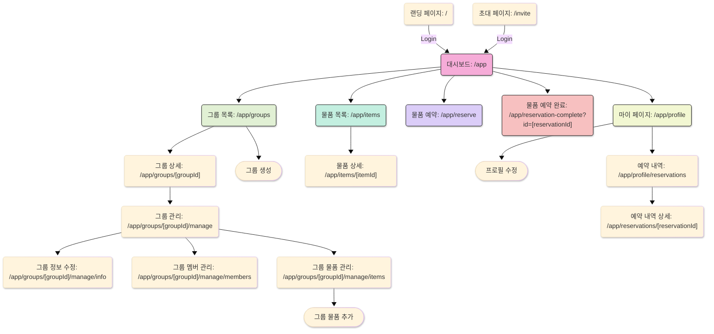

# WeShare 프로젝트

## 링크

[Component 보기(Storybook)](https://www.chromatic.com/library?appId=679f6f9efeda6bdd03477eb9)

## 프로젝트 소개

이 프로젝트는 그룹 내의 공용 물건을 관리하기 위한 웹 어플리케이션입니다.

## 프로젝트 동기

오프라인에서 같은 그룹 내에서 공용 물건을 관리할 때, 누가 물건을 사용하고 있는지, 어디에 있는지 등을 파악하기 어려웠습니다. 이를 해결하기 위해 그룹 내에서 공용 물건을 관리할 수 있는 웹 어플리케이션을 만들어보고자 합니다.

## 프로젝트 인원

- 기획: 2명
- 디자인: 1명
- 웹 프론트엔드: 1명
- 백엔드: 2명

## 프로젝트 구조

This Turborepo includes the following packages/apps:

### 리포지토리 구조

- `docs`: a [Vite](https://nextjs.org/) app with Storybook
- `web`: [Next.js](https://nextjs.org/) app with [Tailwind CSS](https://tailwindcss.com/)
- `ui`: a stub React component library with [Tailwind CSS](https://tailwindcss.com/) shared by both `web` and `docs` applications
- `@repo/eslint-config`: `eslint` configurations (includes `eslint-config-next` and `eslint-config-prettier`)
- `@repo/typescript-config`: `tsconfig.json`s used throughout the monorepo
- `@repo/tailwind-config`: `theme.css` used throughout the monorepo

### 페이지 구조



### 주요 엔티티

- User: 서비스를 이용하는 사용자이다
- Group: 공용 물건을 관리하는 그룹이다
- GroupMember: 그룹에 속한 사용자이다
- GroupBoard: 그룹 내에서 게시글을 작성하는 것이다(그룹 게시판)
- Item: 그룹 내에서 관리되는 공용 물건이다
- RentalRequest: 사용자가 물건을 빌리기 위해 요청하는 것이다(대여 요청)
- RentalRecord: 물건을 빌려준 기록이다(대여 내역)
- WishList: 사용자가 물건을 빌리고 싶어하는 것이다(찜 목록)
- Reservation: 사용자가 물건을 빌리기 위해 예약하는 것이다(예약)

### 페이지 라우팅

| Title                    | Path                         | Description                               |
| ------------------------ | ---------------------------- | ----------------------------------------- |
| 홈                       | `/`                          | 홈 페이지입니다.                          |
| 로그인                   | `/login`                     | 로그인 페이지입니다.                      |
| 그룹 목록                | `/groups`                    | 그룹 목록 페이지입니다.                   |
| 그룹 상세                | `/groups/:groupId`           | 그룹 상세 페이지입니다.                   |
| 그룹 설정                | `/groups/:groupId/settings`  | 그룹 설정 페이지입니다.                   |
| 그룹 생성                | `/groups/create`             | 그룹 생성 페이지입니다.                   |
| 물품 리스트              | `/items`                     | 물품 리스트 페이지입니다.                 |
| 물품 상세                | `/items/:itemId`             | 물품 상세 페이지입니다.                   |
| 물품 예약                | `/items/:itemId/reservation` | 물품 예약 페이지입니다.                   |
| 예약/대여 내역           | `/records`                   | 마이페이지의 예약/대여 내역 페이지입니다. |
| 마이페이지               | `/profile`                   | 마이페이지입니다.                         |
| 마이페이지 - 프로필 수정 | `/profile/edit`              | 마이페이지의 프로필 수정 페이지입니다.    |

## 문제

### 1. tailwindcss 적용 시 클래스 중복 문제

`ui:text-detail-3 ui:text-positive`를 적용하면 뒤에 오는 클래스만 적용되는 문제
`ui:text-positive` -> `ui:text-semantic-positive`으로 변경해보았지만 동일한 문제 발생
`ui:text-detail-3` -> `ui:text-detail3`로 변경해보았지만 동일한 문제 발생
`tailwind-merge config > classGroups`를 적용하여 문제 해결

```javascript
const twMergeConfig = {
  extend: {
    classGroups: {
      "font-size": [
        {
          text: [
            "heading-1",
            "heading-2",
            "heading-3",
            "heading-4",
            "heading-5",
            "body-1",
            "body-2",
            "body-3",
            "body-4",
            "body-5",
            "body-6",
            "detail-1",
            "detail-2",
            "detail-3",
          ],
        },
      ],
    },
  },
};
```

### 2. 타입스크립트 문제

```plaintext
'BottomSheetContent'의 유추된 형식 이름을 지정하려면 '.pnpm/@radix-ui+react-dialog@1.1._79c1088916460d1027207019201b4fa5/node_modules/@radix-ui/react-dialog'에 대한 참조가 있어야 합니다. 이식하지 못할 수 있습니다. 형식 주석이 필요합니다.ts(2742)
```

```typescript
//tsconfig.json
{
  //...
  "compilerOptions": {
    "declaration": false,
    "declarationMap": false
  },
}
```
